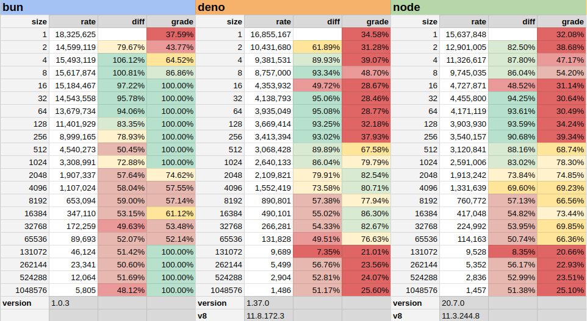

# UTF-8 Encoding JS Benchmark

This benchmark was created in order to investigate performance differences
between Bun and Deno JS runtimes highlighted [here](https://github.com/denoland/deno/issues/20409).

The benchmark encodes a dynamically created latin1/ascii string for all power of two sizes up to 1 MB.

Currently the bench only runs on Linux, but could be quite easily adapted to run on any posix-y platform if we had a standard cross-platform/runtime way to get the memory usage.

To run the benchmark, you will need to install the various JS runtimes and have them available on your path.

e.g. To run for Deno

```bash
make deno
```

or, if you have bun, node and deno on your path, just run

```bash
make clean popular
```

and this will delete any existing results and run the benches for bun, deno and node.js.

results are output as json in results.{runtime}.json, and comprise an array of results that look like this

```JavaScript
  {
    "name": "1", // size of the payload
    "count": 32847960, // the number of runs completed
    "elapsed": 1821.594236, // the number of milliseconds elapsed
    "rate": 18032534, // the rate of operations
    "nanos": 55.4553231398316, // the nanoseconds per operation
    "rss": 90828, // memory usage at time of sample (from /proc/self/stat)
    "runtime": {
      "name": "bun", // name of the runtime
      "version": "1.0.3" // version of the runtime
    }
  },

```

each results file will contain 5 runs for each payload size. this can be changed in the utf8.mjs script.

There is a google sheet [here](https://docs.google.com/spreadsheets/d/1UDjNioC8a9UW2swBfKfMz6IXgGTAvmHkQ-Z7nud05f0/edit?usp=sharing) with results from a run. Feel free to copy and you can update the results for each framework by generating the rates from the results files as follows. 

```
deno run -A process.mjs node
deno run -A process.mjs deno
deno run -A process.mjs bun
```

This will use deno to process the ```results.node.json``` file which will output a result on a separate line for each payload size, starting from 1 and increasing by a power of two to 1 million.

You can use any of the runtimes to run the scripts. ```bench.mjs``` has some code which creates a common abstraction across the runtime for some of the basic primitives we need to do the benchmark.

```process.mjs``` will discard the first result from the 5 runs and select the max of the remaining run. this will probably change.

You can paste the results into the google sheet. Here is what they look like.


